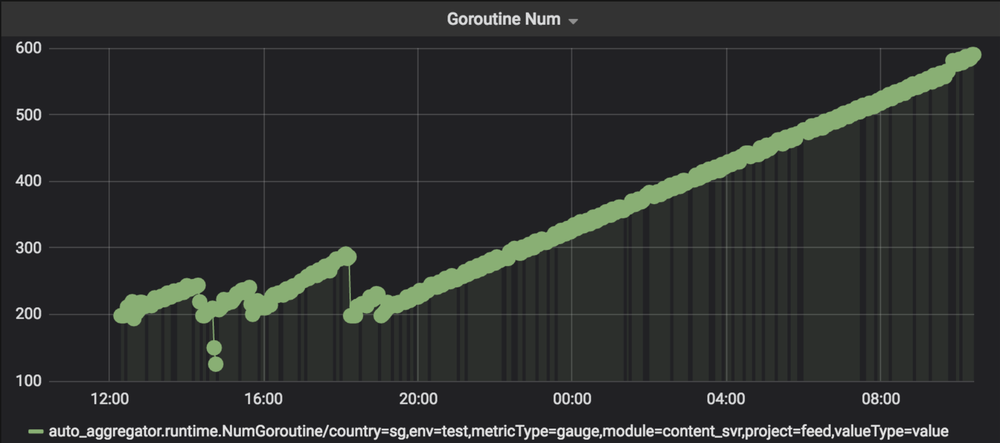

## 定位过程

问题：

Dump goroutines:

    ps aux | grep 'content_svr' #43
    kill -USR2 43
比较两小时间的Diff：
两小时前:

    $ grep 'cron/hashtag_suggestion' /proc/43/fd/1
    1
    $ grep 'producer' /proc/43/fd1
    53
两小时后:

    $ grep 'cron/hashtag_suggestion' /proc/43/fd/1
    41
    $ grep 'producer' /proc/43/fd1
    221

## 问题代码

    // 简化了业务逻辑

    type Cron struct{
        ch1 chan []int
        ch2 chan []int
    }

    func (cron *Cron)start() {
        timer := time.NewTicker(cron.taskDuration)
        for {
            select {
            case <-timer.C:
                cron.doCron()
            }
        }
    }

    func (cron *Cron)doCron() {
        cron.step1()
        cron.step2()
        cron.step3()
    }

    func (cron *Cron)step1() {
        go func(){
            cron.ch1 <- []int{100}
            // 注意这里没有关闭ch1，导致下面的goroutine一直没有关闭
        }()
    }

    func (cron *Cron)step2() {
        go func(){
            for item := range cron.ch1 {
                _ = item
                cron.ch2 <- []int{200}
                // 注意这里没有关闭ch2，导致下面的goroutine一直没有关闭
            }
        }()
    }

    func (cron *Cron)step3() {
        go func(){
            for item := range cron.ch2 {
                _ = item
            }
        }()
    }

## 纠正

    // 1. 每次创建goroutine时候创建channel
    // 2. 每次使用完channel，close channel，退出goroutine

    type Cron struct{
        ch1 chan []int
        ch2 chan []int
    }

    const (
        concurrency = 100
    )
    func (cron *Cron)start() {
        timer := time.NewTicker(cron.taskDuration)
        for {
            select {
            case <-timer.C:
                cron.doCron()
            }
        }
    }

    func (cron *Cron)doCron() {
        cron.ch1 = make(chan []int, concurrency) // fixed
        cron.ch2 = make(chan []int, concurrency) // fixed
        
        cron.step1()
        cron.step2()
        cron.step3()
    }

    func (cron *Cron)step1() {
        go func(){
            cron.ch1 <- []int{100}
            close(ch1) // fixed
        }()
    }

    func (cron *Cron)step2() {
        go func(){
            for item := range cron.ch1 {
                _ = item
                cron.ch2 <- []int{200}
                close(ch2) // fixed
            }
        }()
    }

    func (cron *Cron)step3() {
        go func(){
            for item := range cron.ch2 {
                _ = item
            }
        }()
    }
